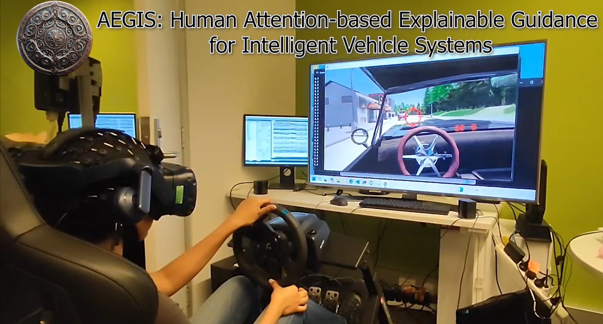

# AEGIS: Human Attention-based Explainable Guidance for Intelligent Vehicle Systems

**[ACM SIGCHI 2025]**  
Official repository for the paper: *AEGIS: Human Attention-based Explainable Guidance for Intelligent Vehicle Systems*, presented at ACM SIGCHI 2025.

---

## ⚙️ Create the Environment

Make sure you have [Anaconda](https://www.anaconda.com/download) or [Miniconda](https://docs.conda.io/en/latest/miniconda.html) installed.

Then, run the following command in your terminal:

```bash
conda env create -f environment.yml
```
or 
```bash
conda create -n aegis python==3.7
conda activate aegis
pip install -r requirements.txt
```
## What do AEGIS provide? Please click to view the video &#x2193;&#x2193;&#x2193;

[](https://www.youtube.com/watch?v=RiyZsicPuQ0)


## 🚗 Running the CARLA Simulator

```bash
# Create and navigate to the CARLA directory
mkdir carla
cd carla

# Download and extract CARLA 0.9.14
wget https://carla-releases.s3.us-east-005.backblazeb2.com/Linux/CARLA_0.9.14.tar.gz
tar -xvf CARLA_0.9.14.tar.gz

# Launch the simulator
./CarlaUE4.sh --world-port=2000
```

## 🧠 Training AEGIS for the Car-Following Scenario
```
python train_car_following.py --simulator_port 2000
```

Training AEGIS for the Left-Turn Scenario
```
python train_left_turn.py --simulator_port 2000
```

## Evaluate AEGIS for the Car-Following Scenario
```
python eval_car_following_save.py --bin-file "S07\recording.bin" --out-dir "output"
```
You should be able to visualize the machine attention using this evalutation script.

## Dataset

We use a recompiled version of CARLA by **DReyeVR** to collect eye-tracking data. The data collection platform is built upon the following open-source project:  
https://github.com/HARPLab/DReyeVR

To reproduce the dataset, please download the replay files from:  
https://huggingface.co/datasets/zzhuan/AEGIS_dataset/tree/main

Frame images and corresponding eye-tracking annotations can be generated using the provided replay script:

```bash
cd replay_save_image
python start_replaying_spawn_cam.py
```


## 📄 Paper

- __Zhuang Z__, Lu CY, Wang YK, Chang YC, Thomas Do, Lin CT. *"AEGIS: Human Attention-based Explainable Guidance for Intelligent Vehicle Systems"*. **ACM CHI Conference on Human Factors in Computing Systems**, 2025.


## citation

```
@inproceedings{silvera2022dreyevr,
  title={DReyeVR: Democratizing Virtual Reality Driving Simulation for Behavioural \& Interaction Research},
  author={Silvera, Gustavo and Biswas, Abhijat and Admoni, Henny},
  booktitle={Proceedings of the 2022 ACM/IEEE International Conference on Human-Robot Interaction},
  pages={639--643},
  year={2022}
}
```
You can read our paper on arXiv here:  
[**AEGIS: Human Attention-based Explainable Guidance for Intelligent Vehicle Systems** (arXiv:2504.05950)](https://arxiv.org/abs/2504.05950)

[](https://arxiv.org/pdf/2504.05950)

